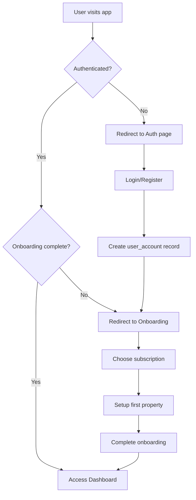

# RentEase - Property Management System Documentation

## 🏢 System Overview

RentEase is a comprehensive SaaS property management platform designed for landlords and property agents. The system streamlines rental property management, tenant tracking, rent collection, invoicing, and communication through an intuitive web interface.

## 📋 Table of Contents

1. [Features Overview](#features-overview)
2. [System Architecture](#system-architecture)
3. [Mobile Responsiveness](#mobile-responsiveness)
4. [Project Structure](#project-structure)
5. [Key Components](#key-components)
6. [Authentication System](#authentication-system)
7. [Database Schema](#database-schema)
8. [Subscription Management](#subscription-management)
9. [Admin Dashboard](#admin-dashboard)
10. [Component Relationships](#component-relationships)
11. [Configuration & Setup](#configuration--setup)
12. [Deployment Guide](#deployment-guide)

## 🌟 Features Overview

### Core Property Management
- **Property Management**: Add, edit, and manage multiple properties with detailed information
- **Unit Management**: Track individual units within properties, vacancy status, and rent amounts
- **Tenant Management**: Complete tenant profiles with contact information and lease details
- **Financial Tracking**: Invoice generation, payment tracking, and expense management

### Dashboard & Analytics
- **Dashboard Overview**: Visual statistics showing occupancy rates, revenue, and key metrics
- **Financial Reports**: Track income, expenses, and generate custom reports
- **Property Analytics**: Analyze performance across properties and units

### Documentation & Communication
- **Document Management**: Store and manage property-related documents
- **Messaging System**: Communication platform for landlords and tenants
- **SMS Notifications**: Automated rent reminders and payment confirmations

### SaaS Features
- **Multi-tenant Architecture**: Each user has isolated data access
- **Subscription Management**: Tiered pricing with feature limits
- **Admin Dashboard**: Platform-wide analytics and user management
- **Demo Mode**: Full-featured demo for potential customers

## 🏗️ System Architecture

```
┌─────────────────┐    ┌─────────────────┐    ┌─────────────────┐
│   Frontend      │    │   Supabase      │    │  External APIs  │
│   (React)       │    │   Backend       │    │  (Future)       │
├─────────────────┤    ├─────────────────┤    ├─────────────────┤
│ • Dashboard     │◄──►│ • Database      │◄──►│ • Payment       │
│ • Property Mgmt │    │ • Auth          │    │   Processing    │
│ • Tenant Mgmt   │    │ • RLS Policies  │    │ • SMS Service   │
│ • Financials    │    │ • Storage       │    │                 │
│ • Documents     │    │ • Real-time     │    │                 │
│ • Admin Panel   │    │   Updates       │    │                 │
└─────────────────┘    └─────────────────┘    └─────────────────┘
```

### Technology Stack
- **Frontend**: React 18, TypeScript, Tailwind CSS, Shadcn/UI
- **Backend**: Supabase (PostgreSQL, Auth, Real-time, Storage)
- **State Management**: TanStack Query (React Query)
- **Routing**: React Router DOM v6
- **UI Components**: Radix UI primitives with Shadcn/UI
- **Charts**: Recharts
- **Form Handling**: React Hook Form with Zod validation
- **Build Tool**: Vite

## 📱 Mobile Responsiveness

RentEase is designed with a mobile-first approach to ensure a seamless experience across all device sizes. The application employs several advanced techniques to deliver optimal user experience on mobile devices.

### Mobile Navigation System

```
┌─────────────────────────────────────────────┐
│                  Mobile View                 │
├─────────────────────────────────────────────┤
│ ┌─────────┐                      ┌────┐ ┌──┐ │
│ │ ≡ Menu  │  RentEase            │ 🔔 │ │👤│ │
│ └─────────┘                      └────┘ └──┘ │
│ ┌─────────────────────────────────────────┐ │
│ │                                         │ │
│ │               Content Area              │ │
│ │                                         │ │
│ │  • Responsive cards                     │ │
│ │  • Touch-optimized controls            │ │
│ │  • Swipe gestures                      │ │
│ │                                         │ │
│ └─────────────────────────────────────────┘ │
└─────────────────────────────────────────────┘
```

### Key Mobile Features

1. **Responsive Layout System**
   - Adaptive grid layouts for different screen sizes
   - Mobile-optimized spacing and typography
   - Touch-friendly UI elements with appropriate sizing

2. **Touch Gesture Support**
   - Swipe to open/close sidebar navigation
   - Touch-optimized interaction patterns
   - Active state feedback for touch interactions

3. **Mobile-First Components**
   - Card-based views for data tables on small screens
   - Stacked layouts for forms on mobile devices
   - Optimized input fields for mobile keyboards

### Mobile Component Architecture

```typescript
// Mobile detection hook
export function useIsMobile() {
  const [isMobile, setIsMobile] = useState<boolean | undefined>(undefined);

  useEffect(() => {
    const mql = window.matchMedia(`(max-width: ${MOBILE_BREAKPOINT - 1}px)`);
    const onChange = () => {
      setIsMobile(window.innerWidth < MOBILE_BREAKPOINT);
    };
    mql.addEventListener("change", onChange);
    setIsMobile(window.innerWidth < MOBILE_BREAKPOINT);
    return () => mql.removeEventListener("change", onChange);
  }, []);

  return !!isMobile;
}

// Mobile menu context provider
export const MobileMenuContext = createContext<MobileMenuContextType>({
  isMobileMenuOpen: false,
  toggleMobileMenu: () => {},
  closeMobileMenu: () => {},
});
```

### Responsive UI Components

- **ResponsiveGrid**: Adaptive grid system with configurable breakpoints
- **RentCard**: Mobile-optimized card component for rent payment information
- **ResponsiveTable**: Table component that transforms into cards on mobile
- **ResponsiveForm**: Form layout component with mobile-first design
- **PageWrapper**: Container component that ensures consistent padding and max-width

### Mobile-Specific Optimizations

1. **Performance Optimizations**
   - Optimized animations and transitions
   - Reduced layout shifts on mobile
   - Touch event throttling for improved responsiveness

2. **Visual Adaptations**
   - Condensed header with essential actions
   - Full-width cards on mobile
   - Optimized font sizes for readability

3. **Interaction Patterns**
   - Bottom-aligned action buttons for thumb access
   - Slide-in patterns for secondary content
   - Tap-friendly hit areas (minimum 44x44px)

## 🗄️ Database Schema

### Core Tables

#### user_accounts
```sql
CREATE TABLE user_accounts (
  id UUID PRIMARY KEY DEFAULT gen_random_uuid(),
  auth_user_id UUID REFERENCES auth.users(id),
  email TEXT NOT NULL UNIQUE,
  first_name TEXT NOT NULL,
  last_name TEXT NOT NULL,
  phone TEXT,
  company_name TEXT,
  role TEXT DEFAULT 'landlord',
  is_active BOOLEAN DEFAULT true,
  is_demo BOOLEAN DEFAULT false,
  onboarding_completed BOOLEAN DEFAULT false,
  trial_ends_at TIMESTAMP WITH TIME ZONE,
  created_at TIMESTAMP WITH TIME ZONE DEFAULT now(),
  updated_at TIMESTAMP WITH TIME ZONE DEFAULT now()
);
```

#### properties
```sql
CREATE TABLE properties (
  id UUID PRIMARY KEY DEFAULT gen_random_uuid(),
  user_id UUID REFERENCES user_accounts(id),
  name TEXT NOT NULL,
  address TEXT NOT NULL,
  property_type TEXT DEFAULT 'apartment',
  total_units INTEGER DEFAULT 0,
  caretaker_name TEXT,
  created_at TIMESTAMP WITH TIME ZONE DEFAULT now(),
  updated_at TIMESTAMP WITH TIME ZONE DEFAULT now()
);
```

#### units
```sql
CREATE TABLE units (
  id UUID PRIMARY KEY DEFAULT gen_random_uuid(),
  property_id UUID REFERENCES properties(id),
  unit_number TEXT NOT NULL,
  status TEXT DEFAULT 'vacant',
  created_at TIMESTAMP WITH TIME ZONE DEFAULT now(),
  updated_at TIMESTAMP WITH TIME ZONE DEFAULT now()
);
```

#### tenants
```sql
CREATE TABLE tenants (
  id UUID PRIMARY KEY DEFAULT gen_random_uuid(),
  user_id UUID REFERENCES user_accounts(id),
  unit_id UUID REFERENCES units(id),
  first_name TEXT NOT NULL,
  last_name TEXT NOT NULL,
  phone_number TEXT,
  status TEXT DEFAULT 'active',
  created_at TIMESTAMP WITH TIME ZONE DEFAULT now(),
  updated_at TIMESTAMP WITH TIME ZONE DEFAULT now()
);
```

### Financial Tables

#### invoices
```sql
CREATE TABLE invoices (
  id UUID PRIMARY KEY DEFAULT gen_random_uuid(),
  user_id UUID REFERENCES user_accounts(id),
  tenant_id UUID REFERENCES tenants(id),
  amount DECIMAL(10,2) NOT NULL,
  status TEXT DEFAULT 'pending',
  due_date DATE,
  paid_amount DECIMAL(10,2) DEFAULT 0,
  payment_method TEXT,
  payment_reference TEXT,
  paid_at TIMESTAMP WITH TIME ZONE,
  created_at TIMESTAMP WITH TIME ZONE DEFAULT now(),
  updated_at TIMESTAMP WITH TIME ZONE DEFAULT now()
);
```

#### expenses
```sql
CREATE TABLE expenses (
  id UUID PRIMARY KEY DEFAULT gen_random_uuid(),
  user_id UUID REFERENCES user_accounts(id),
  property_id UUID REFERENCES properties(id),
  description TEXT NOT NULL,
  amount DECIMAL(10,2) NOT NULL,
  category TEXT NOT NULL,
  expense_date DATE DEFAULT CURRENT_DATE,
  receipt_url TEXT,
  created_at TIMESTAMP WITH TIME ZONE DEFAULT now(),
  updated_at TIMESTAMP WITH TIME ZONE DEFAULT now()
);
```

### Subscription & Payment Tables

#### subscription_plans
```sql
CREATE TABLE subscription_plans (
  id UUID PRIMARY KEY DEFAULT gen_random_uuid(),
  name TEXT NOT NULL,
  description TEXT,
  price DECIMAL(10,2) NOT NULL,
  currency TEXT DEFAULT 'KES',
  billing_interval TEXT DEFAULT 'monthly',
  max_properties INTEGER,
  max_units INTEGER,
  features JSONB DEFAULT '[]',
  is_active BOOLEAN DEFAULT true,
  created_at TIMESTAMP WITH TIME ZONE DEFAULT now(),
  updated_at TIMESTAMP WITH TIME ZONE DEFAULT now()
);
```

#### user_subscriptions
```sql
CREATE TABLE user_subscriptions (
  id UUID PRIMARY KEY DEFAULT gen_random_uuid(),
  user_id UUID REFERENCES user_accounts(id),
  plan_id UUID REFERENCES subscription_plans(id),
  status TEXT DEFAULT 'active',
  current_period_start TIMESTAMP WITH TIME ZONE NOT NULL,
  current_period_end TIMESTAMP WITH TIME ZONE NOT NULL,
  payment_method TEXT,
  payment_reference TEXT,
  amount_paid DECIMAL(10,2),
  next_billing_date TIMESTAMP WITH TIME ZONE,
  created_at TIMESTAMP WITH TIME ZONE DEFAULT now(),
  updated_at TIMESTAMP WITH TIME ZONE DEFAULT now()
);
```

#### payment_transactions
```sql
CREATE TABLE payment_transactions (
  id UUID PRIMARY KEY DEFAULT gen_random_uuid(),
  user_id UUID REFERENCES user_accounts(id),
  subscription_id UUID REFERENCES user_subscriptions(id),
  amount DECIMAL(10,2) NOT NULL,
  currency TEXT DEFAULT 'KES',
  payment_method TEXT NOT NULL,
  payment_reference TEXT NOT NULL,
  external_transaction_id TEXT,
  status TEXT DEFAULT 'pending',
  metadata JSONB DEFAULT '{}',
  processed_at TIMESTAMP WITH TIME ZONE,
  created_at TIMESTAMP WITH TIME ZONE DEFAULT now()
);
```

### Communication Table

#### sms_notifications
```sql
CREATE TABLE sms_notifications (
  id UUID PRIMARY KEY DEFAULT gen_random_uuid(),
  user_id UUID REFERENCES user_accounts(id),
  tenant_id UUID REFERENCES tenants(id),
  phone_number TEXT NOT NULL,
  message TEXT NOT NULL,
  type TEXT NOT NULL, -- rent_reminder, payment_confirmation, general
  status TEXT DEFAULT 'pending',
  external_message_id TEXT,
  error_message TEXT,
  sent_at TIMESTAMP WITH TIME ZONE,
  created_at TIMESTAMP WITH TIME ZONE DEFAULT now()
);
```

## 🔐 Authentication System

### Dual Authentication System

RentEase implements two distinct authentication systems:

1. **User Authentication** (Landlords/Agents)
   - Managed through `useAuth.tsx` hook
   - Handles user registration, login, and session management
   - Maintains user profile data in `user_accounts` table
   - Implements password reset functionality
   - Session refresh mechanism for persistent login

2. **Admin Authentication**
   - Separate system managed through `useAdminAuth.tsx` hook
   - Restricted access to administrative functions
   - Different login page and protected routes

### AuthGuard Component

The `AuthGuard` component (`components/layout/AuthGuard.tsx`) protects routes based on:

- Authentication status
- Completion of onboarding
- User role

It handles redirects to appropriate pages when access conditions aren't met and supports password reset flows.

### Authentication Flow

1. **Registration**:
   - User submits registration form with email, password, and profile information
   - Supabase creates authentication record
   - Application creates corresponding entry in `user_accounts` table
   - User is directed to onboarding process

2. **Login**:
   - User enters credentials
   - On successful authentication:
     - If onboarding is incomplete, redirected to onboarding
     - If onboarding is complete, redirected to dashboard
     - If account record missing, one is automatically created

3. **Session Management**:
   - JWT token stored in browser
   - Automatic session refresh every hour
   - Persistent login across browser sessions

4. **Password Reset**:
   - User requests password reset via email
   - Email contains secure reset link
   - User creates new password
   - Redirect to login

### Authentication Flow


### Key Components
- **AuthProvider** (`src/hooks/useAuth.tsx`): Manages authentication state
- **AuthGuard** (`src/components/layout/AuthGuard.tsx`): Protects routes
- **Auth Page** (`src/pages/Auth.tsx`): Login/register interface
- **Onboarding** (`src/pages/Onboarding.tsx`): Multi-step setup process

## 🧩 Project Structure

RentEase follows a modular, feature-based organization to manage the complexity of the application. Below is a comprehensive overview of the project structure:

```
src/
├── App.tsx                 # Main application component with routing
├── App.css                 # Global application styles
├── index.css               # Tailwind and global CSS
├── main.tsx                # Application entry point
├── components/             # Reusable UI components
│   ├── admin/              # Admin dashboard components
│   ├── dashboard/          # Dashboard widgets and visualizations
│   ├── forms/              # Reusable form components
│   ├── layout/             # Layout components (Sidebar, Header, etc.)
│   ├── onboarding/         # Onboarding flow components
│   ├── subscription/       # Subscription management components
│   └── ui/                 # Base UI components (shadcn/ui)
├── hooks/                  # Custom React hooks
│   ├── useAuth.tsx         # Authentication hook
│   ├── useAdminAuth.tsx    # Admin authentication hook
│   ├── useDashboardData.ts # Dashboard data fetching hook
│   ├── useProperties.ts    # Property management hook
│   ├── useExpenses.ts      # Expense management hook
│   ├── useSMSNotifications.ts # SMS notifications hook
│   ├── useSubscription.ts  # Subscription management hook
│   ├── use-mobile.tsx      # Responsive design hook
│   └── use-toast.ts        # Toast notification hook
├── pages/                  # Page components
│   ├── Index.tsx           # Dashboard/home page
│   ├── Properties.tsx      # Property management page
│   ├── Units.tsx           # Unit management page
│   ├── Tenants.tsx         # Tenant management page
│   ├── Invoices.tsx        # Invoice management page
│   ├── Financials.tsx      # Financial overview page
│   ├── Payments.tsx        # Payment tracking page
│   ├── Expenses.tsx        # Expense tracking page
│   ├── Reports.tsx         # Reporting and analytics page
│   ├── Documents.tsx       # Document management page
│   ├── Messages.tsx        # Messaging system page
│   ├── SMSNotifications.tsx # SMS notification settings page
│   ├── Subscription.tsx    # Subscription management page
│   ├── Profile.tsx         # User profile page
│   ├── Settings.tsx        # Application settings page
│   ├── Auth.tsx            # Authentication page (login/register)
│   ├── Onboarding.tsx      # User onboarding page
│   ├── LandingPage.tsx     # Public landing page
│   ├── AdminDashboard.tsx  # Admin dashboard page
│   ├── AdminLogin.tsx      # Admin login page
│   ├── AdminUnauthorized.tsx # Admin unauthorized access page
│   └── NotFound.tsx        # 404 page
├── integrations/           # External service integrations
│   └── supabase/           # Supabase client and types
│       ├── client.ts       # Supabase client initialization
│       └── types.ts        # TypeScript types for database schema
└── lib/                    # Utility libraries
    └── utils.ts            # Common utility functions
```

## 🔑 Key Components

### Layout Components

#### MainLayout (`components/layout/MainLayout.tsx`)
The primary layout component used across all authenticated pages. It structures the application with a sidebar, header, and main content area.

```tsx
export function MainLayout({ children }: MainLayoutProps) {
  return (
    <div className="flex min-h-screen bg-background">
      <Sidebar />
      <div className="flex flex-col flex-1 overflow-hidden">
        <Header />
        <main className="flex-1 overflow-auto p-4 md:p-6">
          {children}
        </main>
      </div>
    </div>
  );
}
```

#### Sidebar (`components/layout/Sidebar.tsx`)
Provides navigation throughout the application with links to all major sections.

#### Header (`components/layout/Header.tsx`)
Contains user information, notifications, and global actions.

#### AuthGuard (`components/layout/AuthGuard.tsx`)
Protects routes based on authentication status, redirecting users as needed.

### Authentication Components

#### Auth Page (`pages/Auth.tsx`)
Handles user login, registration, and password reset with form validation.

#### Authentication Hook (`hooks/useAuth.tsx`)
Manages authentication state, user sessions, and account data with Supabase integration.

```tsx
export const useAuth = () => {
  const context = useContext(AuthContext);
  if (context === undefined) {
    throw new Error('useAuth must be used within an AuthProvider');
  }
  return context;
};
```

### Dashboard Components

#### Dashboard (`pages/Index.tsx`)
The main dashboard with key statistics and property overview.

#### StatsCard (`components/dashboard/StatsCard.tsx`)
Reusable component for displaying key metrics with icons.

#### PropertyList (`components/dashboard/PropertyList.tsx`)
Displays a list of properties with occupancy information.

#### DueRents (`components/dashboard/DueRents.tsx`)
Shows upcoming and overdue rent payments.

### Property Management

#### Properties Page (`pages/Properties.tsx`)
Manages the list of properties with CRUD operations.

#### Units Page (`pages/Units.tsx`)
Handles individual rental units within properties.

#### Property Forms (`components/forms/PropertyForm.tsx`)
Forms for adding and editing property information.
- Pre-populated with sample data
- All features accessible but clearly marked as demo
- Can upgrade to full account

## 💳 Subscription Management

### Subscription Tiers

#### Starter Plan (KES 2,500/month)
- Up to 5 properties
- Up to 20 units
- Basic reporting
- SMS notifications
- Invoice generation

#### Professional Plan (KES 5,000/month) - Most Popular
- Up to 15 properties
- Up to 100 units
- Advanced reporting
- All Starter features
- Expense tracking
- Priority support

#### Enterprise Plan (KES 10,000/month)
- Unlimited properties
- Unlimited units
- All features
- Custom integrations
- Advanced analytics
- Dedicated support

### Subscription Flow
1. User selects plan on subscription page
2. Payment modal shows supported payment methods
3. Payment processed (demo mode skips actual payment)
4. Subscription record created
5. User gains access to plan features

## 💰 Payment Integration

### Supported Payment Methods

#### M-Pesa Integration
```typescript
// Mock M-Pesa API integration
const processMpesaPayment = async (data) => {
  // In production, integrate with Safaricom M-Pesa API
  return {
    amount: data.amount,
    method: 'mpesa',
    reference: data.mpesa_receipt_number,
    externalId: data.trans_id,
    metadata: {
      phone_number: data.msisdn,
      account_reference: data.account_reference
    }
  };
};
```

#### KCB Bank Integration
```typescript
// Mock KCB Bank API integration
const processKcbPayment = async (data) => {
  // In production, integrate with KCB Bank API
  return {
    amount: data.amount,
    method: 'kcb',
    reference: data.reference_number,
    externalId: data.transaction_id,
    metadata: {
      account_number: data.account_number,
      branch_code: data.branch_code
    }
  };
};
```

### Payment Processing Flow
1. External payment received (M-Pesa/KCB webhook)
2. Edge function `process-payment` triggered
3. Payment data parsed and validated
4. Transaction record created
5. Smart matching to outstanding invoices
6. Invoice updated if match found
7. SMS confirmation sent to tenant

### API Keys Configuration
Replace these dummy keys in production:

**M-Pesa API Keys** (in Supabase Secrets):
- `MPESA_CONSUMER_KEY`: Your M-Pesa consumer key
- `MPESA_CONSUMER_SECRET`: Your M-Pesa consumer secret
- `MPESA_PASSKEY`: Your M-Pesa passkey
- `MPESA_SHORTCODE`: Your M-Pesa shortcode

**KCB Bank API Keys** (in Supabase Secrets):
- `KCB_API_KEY`: Your KCB Bank API key
- `KCB_API_SECRET`: Your KCB Bank API secret
- `KCB_ACCOUNT_ID`: Your KCB account identifier

## 📱 SMS Notifications

### AfricaTalking Integration
```typescript
// SMS sending function in Edge Functions
const sendSMS = async (apiKey, username, phoneNumber, message) => {
  const response = await fetch('https://api.africastalking.com/version1/messaging', {
    method: 'POST',
    headers: {
      'apikey': apiKey,
      'Content-Type': 'application/x-www-form-urlencoded',
      'Accept': 'application/json'
    },
    body: new URLSearchParams({
      username: username,
      to: phoneNumber,
      message: message
    })
  });
  
  return await response.json();
};
```

### SMS Types

#### Rent Reminders
- **Due Soon**: Sent 3 days before due date
- **Overdue**: Sent for overdue payments
- **Custom**: Manual reminders for specific tenants

#### Payment Confirmations
- Automatic confirmation when payment detected
- Includes payment amount and reference
- Sent immediately after payment processing

#### General Messages
- Custom messages to selected tenants
- Maintenance notifications
- General announcements

### API Keys Configuration
Replace these dummy keys in Supabase Secrets:
- `AFRICATALKING_API_KEY`: Your AfricaTalking API key
- `AFRICATALKING_USERNAME`: Your AfricaTalking username

## 👑 Admin Dashboard

### Admin Features
- **User Management**: View, activate, suspend user accounts
- **Subscription Overview**: Monitor active subscriptions and revenue
- **Payment Transactions**: Track all platform payments
- **Analytics**: Platform-wide metrics and trends
- **Support**: Manage support tickets and user issues

### Admin Access
- Users with role `admin` can access `/admin` route
- Protected by AuthGuard with role checking
- Comprehensive analytics and management tools

### Key Metrics Tracked
- Total users and growth
- Monthly recurring revenue (MRR)
- Subscription distribution
- Payment success rates
- User engagement metrics

## 📱 Component Relationships

The application follows a hierarchical component structure with clear separation of concerns:

```
App.tsx
├── AuthProvider
│   └── AdminAuthProvider
│       ├── Public Routes
│       │   ├── LandingPage
│       │   └── Auth
│       ├── Protected Routes (AuthGuard)
│       │   ├── Onboarding
│       │   └── MainLayout
│       │       ├── Header
│       │       ├── Sidebar
│       │       └── Content Pages
│       │           ├── Dashboard (Index)
│       │           ├── Properties
│       │           ├── Units
│       │           ├── Tenants
│       │           ├── Financial Pages
│       │           │   ├── Invoices
│       │           │   ├── Payments
│       │           │   ├── Expenses
│       │           │   └── Financials
│       │           ├── Communication
│       │           │   ├── Messages
│       │           │   └── SMSNotifications
│       │           ├── Reports
│       │           ├── Documents
│       │           ├── Settings
│       │           └── Profile
│       └── Admin Routes (AdminAuthGuard)
│           ├── AdminLogin
│           ├── AdminUnauthorized
│           └── AdminDashboard
└── QueryClientProvider
    └── TooltipProvider
        └── Toasters
```

### Data Flow

1. **Authentication State**:
   - `AuthProvider` -> All components via `useAuth` hook

2. **API Data**:
   - React Query hooks -> Page components -> UI components

3. **UI State**:
   - Component state -> Child components via props

4. **Form Submissions**:
   - Form components -> React Hook Form -> API hooks -> Supabase

### State Management Strategy

The application uses a combination of state management approaches:

1. **Server State**: Managed with React Query for API data
2. **Authentication State**: Context API via AuthProvider
3. **Local UI State**: React's useState and useReducer
4. **Form State**: React Hook Form with Zod validation

## 📁 File Structure

```
src/
├── components/
│   ├── admin/                    # Admin dashboard components
│   │   ├── AdminUserManagement.tsx
│   │   ├── AdminSubscriptionOverview.tsx
│   │   ├── AdminPaymentTransactions.tsx
│   │   └── AdminAnalytics.tsx
│   ├── dashboard/               # Dashboard widgets
│   │   ├── StatsCard.tsx
│   │   ├── PropertyList.tsx
│   │   ├── DueRents.tsx
│   │   └── RecentActivities.tsx
│   ├── forms/                   # Form components
│   │   ├── PropertyForm.tsx
│   │   ├── TenantForm.tsx
│   │   └── InvoiceForm.tsx
│   ├── layout/                  # Layout components
│   │   ├── MainLayout.tsx
│   │   ├── Header.tsx
│   │   ├── Sidebar.tsx
│   │   └── AuthGuard.tsx
│   ├── onboarding/              # Onboarding flow
│   │   ├── OnboardingWelcome.tsx
│   │   ├── OnboardingSubscription.tsx
│   │   ├── OnboardingSetup.tsx
│   │   └── OnboardingComplete.tsx
│   ├── subscription/            # Subscription components
│   │   └── SubscriptionPaymentModal.tsx
│   └── ui/                      # Reusable UI components
├── hooks/                       # Custom React hooks
│   ├── useAuth.tsx             # Authentication hook
│   ├── useSubscription.ts      # Subscription management
│   ├── useSMSNotifications.ts  # SMS functionality
│   ├── useProperties.ts        # Property data
│   ├── useExpenses.ts          # Expense data
│   └── useDashboardData.ts     # Dashboard data
├── integrations/
│   └── supabase/               # Supabase integration
│       ├── client.ts           # Supabase client
│       └── types.ts            # Database types
├── pages/                      # Main application pages
│   ├── LandingPage.tsx         # Marketing landing page
│   ├── Auth.tsx                # Authentication page
│   ├── Onboarding.tsx          # User onboarding
│   ├── Index.tsx               # Main dashboard
│   ├── Properties.tsx          # Property management
│   ├── Units.tsx               # Unit management
│   ├── Tenants.tsx             # Tenant management
│   ├── Invoices.tsx            # Invoice management
│   ├── Payments.tsx            # Payment tracking
│   ├── Expenses.tsx            # Expense management
│   ├── Financials.tsx          # Financial overview
│   ├── Subscription.tsx        # Subscription management
│   ├── SMSNotifications.tsx    # SMS dashboard
│   ├── AdminDashboard.tsx      # Admin interface
│   └── NotFound.tsx            # 404 page
├── lib/                        # Utility functions
│   └── utils.ts               # Common utilities
├── App.tsx                     # Main app component
└── main.tsx                    # Application entry point

supabase/
└── functions/                  # Edge Functions
    ├── process-payment/        # Payment processing
    │   └── index.ts
    └── send-rent-reminders/    # SMS automation
        └── index.ts
```

## 🔌 API Documentation

### Edge Functions

#### process-payment
**Endpoint**: `POST /functions/v1/process-payment`

**Purpose**: Process incoming payments from M-Pesa, KCB Bank, or other sources

**Request Body**:
```json
{
  "paymentData": {
    "amount": 25000,
    "reference": "QR7X8Y9Z0A",
    "phone": "+254700000000",
    "account_reference": "PROP001"
  },
  "source": "mpesa"
}
```

**Response**:
```json
{
  "success": true,
  "transaction": {
    "id": "uuid",
    "amount": 25000,
    "status": "completed"
  },
  "matchedInvoice": {
    "id": "uuid",
    "amount": 25000,
    "tenant": "John Doe"
  }
}
```

#### send-rent-reminders
**Endpoint**: `POST /functions/v1/send-rent-reminders`

**Purpose**: Send automated rent reminders to tenants with overdue or due-soon invoices

**Request Body**: `{}`

**Response**:
```json
{
  "success": true,
  "message": "Sent 15 rent reminders"
}
```

### Database Hooks

#### useProperties
```typescript
const { data: properties, isLoading, error } = useProperties();
```

#### useSubscription
```typescript
const { data: subscription } = useUserSubscription();
const { mutate: createSubscription } = useCreateSubscription();
```

#### useSMSNotifications
```typescript
const { data: notifications } = useSMSNotifications();
const { mutate: sendReminders } = useSendRentReminders();
```

## ⚙️ Configuration & Setup

### Environment Variables
All sensitive configuration is managed through Supabase Secrets:

```bash
# Supabase (automatically configured)
SUPABASE_URL=your_supabase_url
SUPABASE_ANON_KEY=your_anon_key
SUPABASE_SERVICE_ROLE_KEY=your_service_role_key

# Payment APIs (add to Supabase Secrets)
MPESA_CONSUMER_KEY=your_mpesa_consumer_key
MPESA_CONSUMER_SECRET=your_mpesa_consumer_secret
MPESA_PASSKEY=your_mpesa_passkey
MPESA_SHORTCODE=your_mpesa_shortcode

KCB_API_KEY=your_kcb_api_key
KCB_API_SECRET=your_kcb_api_secret
KCB_ACCOUNT_ID=your_kcb_account_id

# SMS API (add to Supabase Secrets)
AFRICATALKING_API_KEY=your_africatalking_api_key
AFRICATALKING_USERNAME=your_africatalking_username
```

### Required API Accounts

#### M-Pesa Integration
1. Register at [Safaricom Developer Portal](https://developer.safaricom.co.ke/)
2. Create M-Pesa application
3. Get Consumer Key, Consumer Secret, and Passkey
4. Configure callback URLs for payment notifications

#### KCB Bank Integration  
1. Contact KCB Bank for API access
2. Complete integration documentation
3. Get API credentials and test environment access
4. Configure webhook endpoints for payment notifications

#### AfricaTalking SMS
1. Register at [AfricaTalking](https://africastalking.com/)
2. Purchase SMS credits
3. Get API key and username
4. Configure sender ID if required

### Initial Data Setup
The system automatically creates default subscription plans during migration:
- Starter Plan (KES 2,500/month)
- Professional Plan (KES 5,000/month)  
- Enterprise Plan (KES 10,000/month)

## 🚀 Deployment Guide

RentEase can be deployed using various hosting platforms:

### Deployment Options

1. **Netlify**
   - Connect GitHub repository
   - Build command: `npm run build`
   - Publish directory: `dist`
   - Set environment variables in Netlify dashboard

2. **Vercel**
   - Import project from GitHub
   - Framework preset: Vite
   - Build command: `npm run build`
   - Output directory: `dist`
   - Configure environment variables

### Production Considerations

- Ensure Supabase project is on an appropriate plan for production use
- Set up proper Row Level Security (RLS) policies in Supabase
- Configure proper CORS settings
- Set up a custom domain and SSL certificate
- Implement analytics and error tracking

## 📈 Future Enhancements

1. **Payment Processing Integration**
   - Integration with payment gateways
   - Automated payment matching

2. **Mobile Application**
   - React Native version for landlords
   - Tenant mobile application

3. **Advanced Reporting**
   - Custom report builder
   - Data export options
   - Financial forecasting

4. **AI-Powered Features**
   - Predictive analytics for vacancy rates
   - Automated tenant screening
   - Smart maintenance scheduling

### Development Setup
1. Clone the repository
2. Install dependencies: `npm install`
3. Set up Supabase project and run migrations
4. Configure API keys in Supabase Secrets
5. Start development server: `npm run dev`

### Production Deployment

#### Frontend Deployment (Lovable/Vercel)
1. Connect repository to Lovable or Vercel
2. Configure build settings
3. Deploy frontend application

#### Backend Configuration (Supabase)
1. Set up production Supabase project
2. Run all database migrations
3. Configure RLS policies
4. Deploy Edge Functions
5. Set up Supabase Secrets with production API keys

#### Domain & SSL
1. Configure custom domain in deployment platform
2. Set up SSL certificates
3. Update Supabase Auth settings with production URLs

### Monitoring & Maintenance

#### Performance Monitoring
- Monitor database query performance
- Track Edge Function execution times
- Set up alerts for payment processing failures

#### Backup Strategy
- Supabase handles automated database backups
- Implement additional backup procedures for critical data
- Test restore procedures regularly

#### Security Considerations
- Regularly rotate API keys
- Monitor for suspicious payment activities
- Implement rate limiting on SMS endpoints
- Review RLS policies periodically

## 📊 System Metrics & Analytics

### Key Performance Indicators (KPIs)
- **User Growth**: New registrations per month
- **Revenue Metrics**: MRR, ARR, churn rate
- **Feature Usage**: Property/tenant/invoice creation rates
- **Payment Success**: Payment processing success rates
- **SMS Delivery**: SMS delivery success rates

### Data Export
- Users can export their data in CSV format
- Admin dashboard provides platform-wide analytics
- API endpoints available for custom integrations

## 🔧 Troubleshooting Guide

### Common Issues

#### Payment Not Detected
1. Check webhook configurations
2. Verify API keys in Supabase Secrets
3. Review Edge Function logs
4. Ensure amount matching logic is correct

#### SMS Not Sending
1. Verify AfricaTalking credentials
2. Check SMS credits balance
3. Review phone number formatting
4. Check Edge Function logs for errors

#### Authentication Issues
1. Verify Supabase Auth configuration
2. Check redirect URLs in Auth settings
3. Review RLS policies
4. Ensure user_accounts table sync

### Logging & Debugging
- Edge Function logs available in Supabase dashboard
- Frontend errors logged to browser console
- Database queries logged in Supabase dashboard
- Payment transaction logs stored in database

## 📈 Future Enhancements

### Planned Features
- **Mobile App**: React Native mobile application
- **WhatsApp Integration**: WhatsApp messaging for tenants
- **Advanced Analytics**: Predictive analytics for rent collection
- **Multi-language Support**: Full Swahili localization
- **Property Valuation**: Automated property valuation tools
- **Maintenance Tracking**: Work order and maintenance management

### Integration Roadmap
- **Additional Banks**: Equity Bank, Co-op Bank integrations
- **Accounting Software**: QuickBooks, Sage integration
- **Property Portals**: Integration with property listing websites
- **Government APIs**: Integration with land registry systems

---

## 📞 Support & Contact

For technical support or questions about this documentation:
- **Email**: support@propertypro.co.ke
- **Documentation**: This README file
- **API Reference**: See `/docs` folder
- **Community**: Join our Discord community

**Last Updated**: January 2024
**Version**: 1.0.0
**Author**: PropertyPro Development Team
