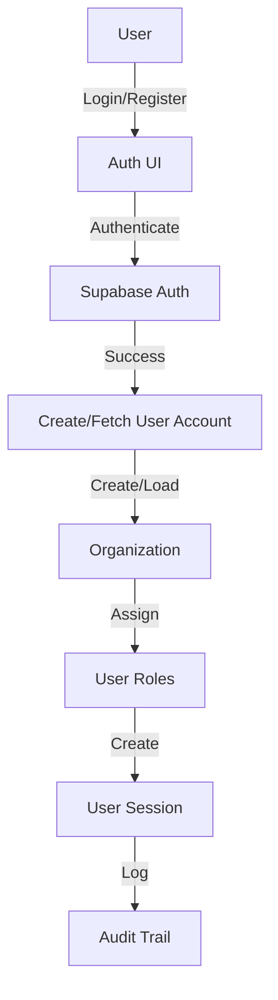
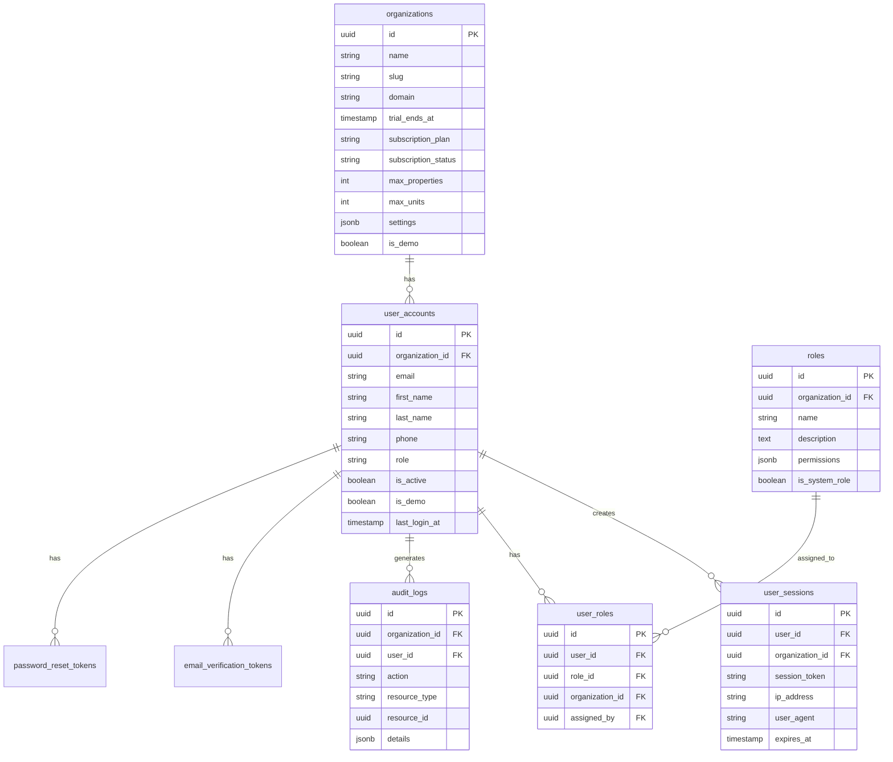
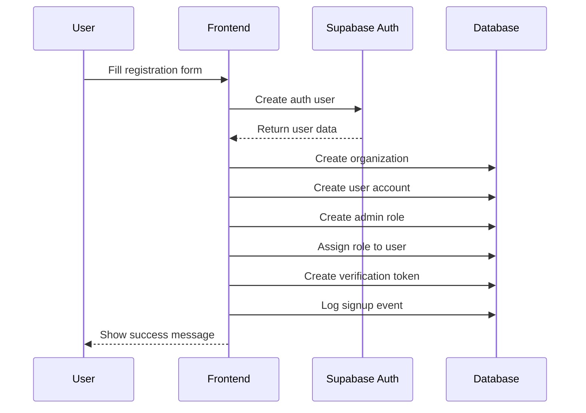
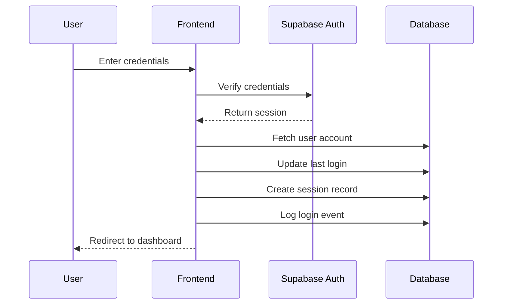

# SmartEstate Authentication System Documentation

## Overview

The SmartEstate authentication system is built on top of Supabase Auth with additional features for organization management, session tracking, and role-based access control. This document outlines the complete authentication flow, database schema, and implementation details.

## Architecture



## Database Schema

### Core Authentication Tables



## Authentication Flows

### 1. Registration Flow



### 2. Login Flow



## Security Features

1. **Multi-tenancy Isolation**
   - Each organization has its own isolated data
   - Cross-organization access is prevented
   - Role-based access within organizations

2. **Session Management**
   - Token-based authentication
   - Session tracking and monitoring
   - Automatic session expiration
   - Device and IP tracking

3. **Audit Trail**
   - All authentication events logged
   - User action tracking
   - Security event monitoring
   - Compliance reporting support

## Implementation Details

### Key Components

1. **Auth Provider (`src/hooks/useAuth.tsx`)**
   - Manages authentication state
   - Handles user sessions
   - Provides auth context to app

2. **Auth UI (`src/pages/Auth.tsx`)**
   - Login/Registration forms
   - Password reset flow
   - Demo account handling
   - Organization setup

### Code Organization

```plaintext
src/
├── hooks/
│   └── useAuth.tsx           # Authentication logic and context
├── pages/
│   └── Auth.tsx             # Authentication UI components
├── integrations/
│   └── supabase/
│       ├── client.ts        # Supabase client configuration
│       └── types.ts         # Database and auth types
└── components/
    └── auth/
        ├── AuthGuard.tsx    # Protected route wrapper
        └── RoleGuard.tsx    # Role-based access control
```

## Environment Configuration

Required environment variables:
```env
VITE_SUPABASE_URL=your_supabase_url
VITE_SUPABASE_ANON_KEY=your_supabase_anon_key
```

## Usage Examples

### Protected Route
```typescript
import { AuthGuard } from '@/components/auth/AuthGuard';

export const ProtectedPage = () => (
  <AuthGuard>
    <YourComponent />
  </AuthGuard>
);
```

### Role-Based Access
```typescript
import { RoleGuard } from '@/components/auth/RoleGuard';

export const AdminOnlyPage = () => (
  <RoleGuard roles={['admin']}>
    <AdminComponent />
  </RoleGuard>
);
```

### Using Auth Context
```typescript
import { useAuth } from '@/hooks/useAuth';

export const UserProfile = () => {
  const { userAccount, updateUserAccount } = useAuth();
  
  // Use auth data and functions
};
```

## Maintenance and Troubleshooting

### Common Issues

1. **Session Expiration**
   - Default session duration: 24 hours
   - Auto refresh enabled
   - Manual refresh available through `refreshSession()`

2. **Organization Access**
   - Users must belong to an organization
   - Organization data loaded with user account
   - Role permissions checked on access

### Monitoring

1. **Audit Logs**
   - Authentication events
   - Session tracking
   - User actions
   - Security events

2. **Session Management**
   - Active sessions tracked
   - Device information stored
   - IP addresses logged
   - Last activity timestamps

## Future Improvements

1. **Enhanced Security**
   - Two-factor authentication
   - Hardware key support
   - IP-based access rules
   - Advanced session management

2. **Organization Features**
   - Organization switching
   - Sub-organizations
   - Team management
   - Custom roles

3. **Monitoring & Analytics**
   - Authentication metrics
   - Security dashboards
   - Usage analytics
   - Compliance reporting

## Best Practices

1. **Security**
   - Use HTTPS for all requests
   - Implement proper CORS policies
   - Regular security audits
   - Monitor auth logs

2. **Performance**
   - Optimize database queries
   - Cache user session data
   - Lazy load permissions
   - Batch audit logging

3. **Maintenance**
   - Regular backups
   - Version control
   - Documentation updates
   - Security patches

## Support and Contact

For authentication-related issues:
1. Check audit logs
2. Verify organization settings
3. Review user permissions
4. Contact system administrator

## Version History

- v1.0.0 (2025-06-14)
  - Initial authentication system
  - Organization management
  - Role-based access control
  - Session tracking
  - Audit logging
