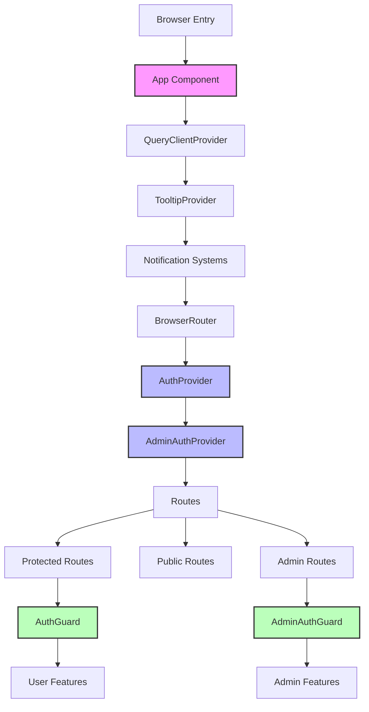
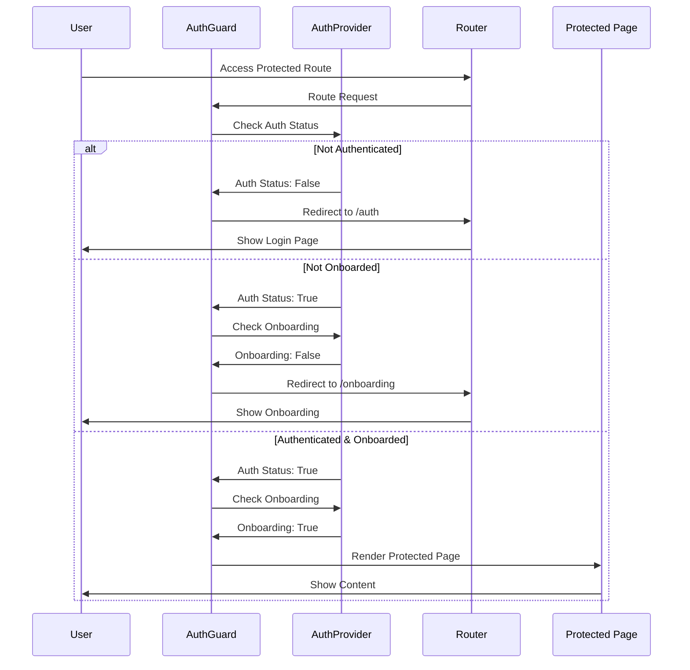
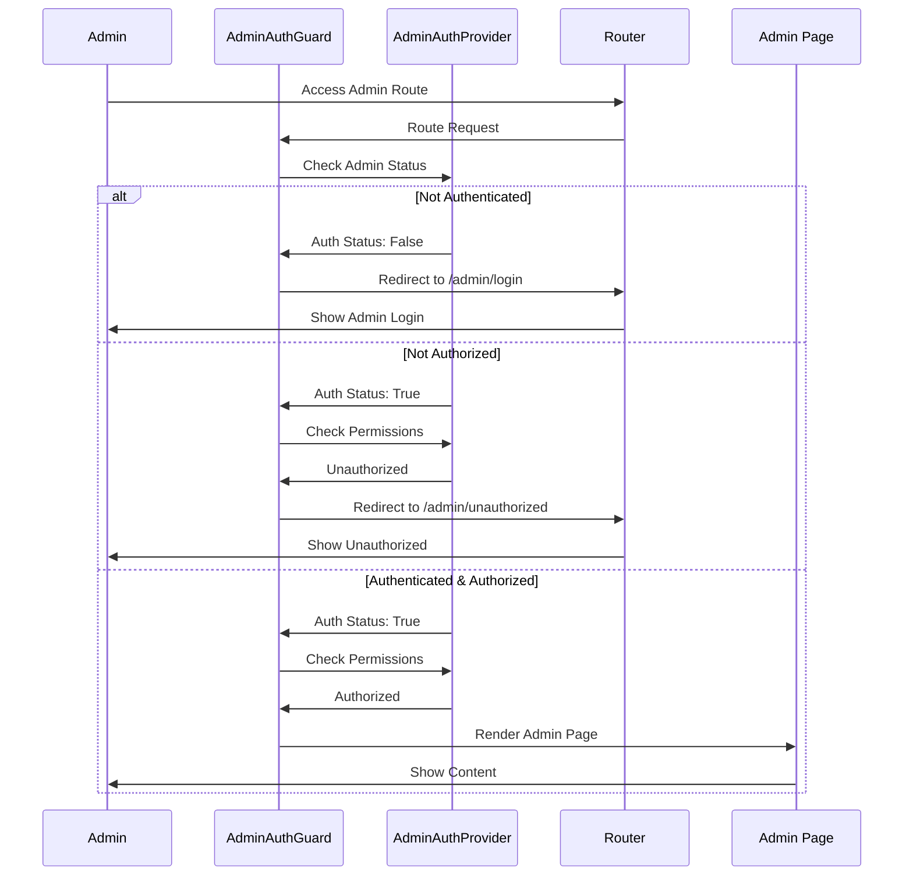
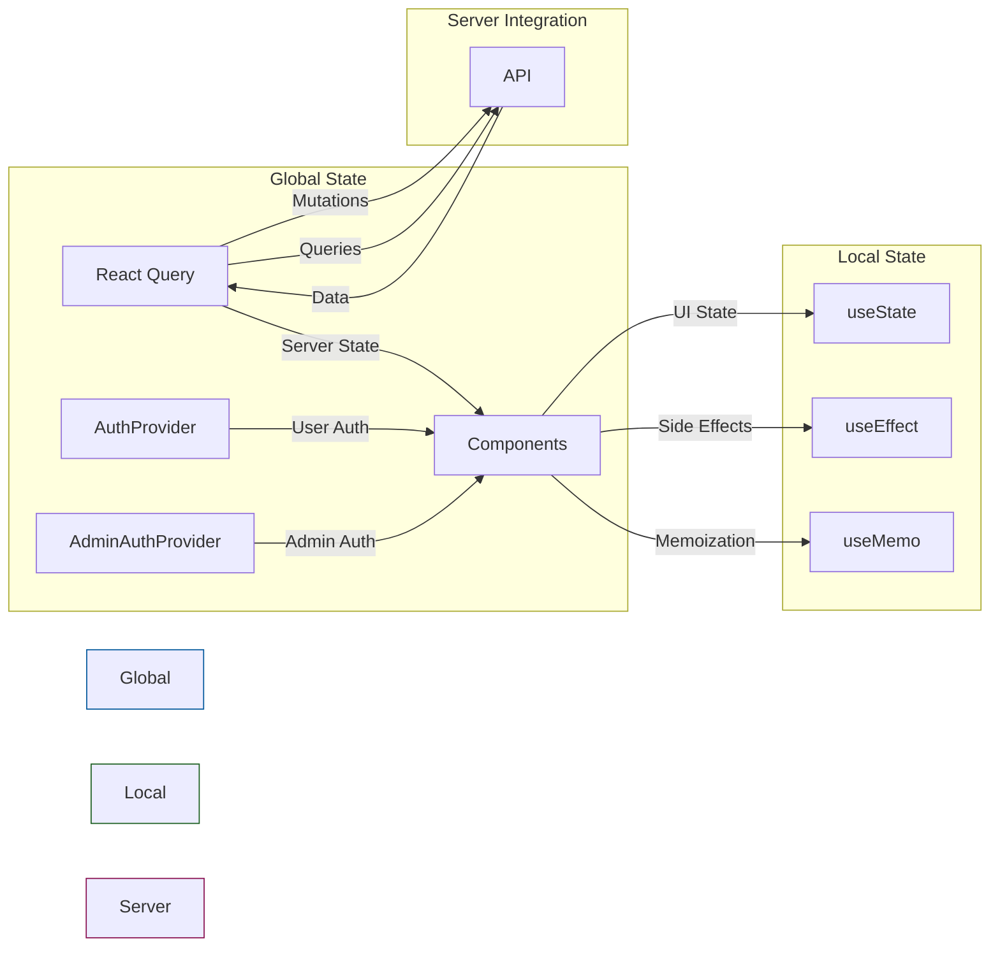

# React App Component Documentation

## Overview

This document provides a comprehensive explanation of the main App component and overall application architecture for the SmartRent Management Suite. The application is built with React and features separate user and admin workflows, incorporating route protection, data fetching, and global UI providers.

### Application Architecture Overview



## Core Technologies

### Client-Side Technologies
- **React**: Core UI library
- **React Router (v6+)**: For declarative routing and navigation
- **React Query**: For server state management and data fetching
- **Custom Auth Providers**: Separate authentication contexts for users and admins
- **Shadcn/UI Components**: For consistent UI components including:
  - Toasters: For notification management
  - Tooltips: For enhanced user experience
  - Other UI components (buttons, cards, etc.)

### State Management
- **React Query**: Handles server state and caching
- **Context API**: Used for auth state management
- **Local State**: Component-level state where appropriate

## Application Structure

### Provider Architecture
```jsx
<QueryClientProvider>
  <TooltipProvider>
    <Toaster />
    <Sonner />
    <BrowserRouter>
      <AuthProvider>
        <AdminAuthProvider>
          <Routes>...</Routes>
        </AdminAuthProvider>
      </AuthProvider>
    </BrowserRouter>
  </TooltipProvider>
</QueryClientProvider>
```

### Provider Details

#### QueryClientProvider
- **Purpose**: Provides React Query client instance
- **Configuration**: Custom configured QueryClient for optimal caching
- **Scope**: Application-wide

#### TooltipProvider
- **Purpose**: Manages tooltip behavior
- **Features**: Consistent tooltip positioning and styling
- **Scope**: Application-wide

#### Notification Systems
- **Toaster**: Primary toast notification system
- **Sonner**: Secondary toast system for specialized notifications
- **Usage**: User feedback, system notifications, error messages

#### BrowserRouter
- **Purpose**: URL history and routing management
- **Features**: Client-side routing without page reloads
- **Integration**: Tightly coupled with route guards

#### Authentication Providers
1. **AuthProvider**
   - Manages user authentication state
   - Provides login/logout functionality
   - Handles user session persistence
   - Exposes user context to child components

2. **AdminAuthProvider**
   - Separate authentication for admin users
   - Different permission levels and access control
   - Admin-specific functionality and routes

## Route Protection System

### AuthGuard Component
**Props**:
- `requireAuth: boolean` - If true, requires user authentication
- `requireOnboarding: boolean` - If true, requires completed onboarding

**Behavior**:
1. Checks authentication status
2. Validates onboarding completion if required
3. Redirects to appropriate route if conditions not met
4. Renders protected content if conditions satisfied

### AdminAuthGuard Component
**Purpose**: Protects admin routes
**Features**:
- Admin-only access control
- Role-based authorization
- Redirects to admin login when needed

## Authentication Flow Diagrams

### User Authentication Flow



### Admin Authentication Flow



## Routing Structure

```mermaid
graph TB
    Root[/] --> Public[Public Routes]
    Root --> Protected[Protected Routes]
    Root --> Admin[Admin Routes]
    
    Public --> Landing[/landing]
    Public --> Auth[/auth]
    Public --> Migration[/apply-migration]
    
    Protected --> Dashboard[/dashboard]
    Protected --> PropMan[Property Management]
    Protected --> TenantMan[Tenant Management]
    Protected --> FinMan[Financial Management]
    Protected --> Services[Services]
    Protected --> Settings[User Settings]
    
    PropMan --> Properties[/properties]
    PropMan --> Units[/units]
    PropMan --> PropDetail[/properties/:id]
    PropMan --> UnitDetail[/units/:id]
    
    TenantMan --> Tenants[/tenants]
    TenantMan --> Messages[/messages]
    
    FinMan --> Invoices[/invoices]
    FinMan --> Financials[/financials]
    FinMan --> Payments[/payments]
    FinMan --> Expenses[/expenses]
    
    Services --> Maintenance[/maintenance]
    Services --> Utilities[/utilities]
    Services --> SMS[/sms]
    Services --> Documents[/documents]
    
    Settings --> Profile[/profile]
    Settings --> AppSettings[/settings]
    Settings --> Subscription[/subscription]
    Settings --> Reports[/reports]
    
    Admin --> AdminLogin[/admin/login]
    Admin --> AdminDash[/admin/dashboard]
    Admin --> AdminUsers[/admin/users]
    Admin --> AdminSubs[/admin/subscriptions]
    Admin --> AdminSec[/admin/security]
    Admin --> AdminSet[/admin/settings]
    
    classDef public fill:#e1f5fe,stroke:#01579b
    classDef protected fill:#e8f5e9,stroke:#1b5e20
    classDef admin fill:#fce4ec,stroke:#880e4f
    
    class Public,Landing,Auth,Migration public
    class Protected,Dashboard,PropMan,TenantMan,FinMan,Services,Settings,Properties,Units,PropDetail,UnitDetail,Tenants,Messages,Invoices,Financials,Payments,Expenses,Maintenance,Utilities,SMS,Documents,Profile,AppSettings,Subscription,Reports protected
    class Admin,AdminLogin,AdminDash,AdminUsers,AdminSubs,AdminSec,AdminSet admin
```

## Best Practices and Conventions

### Route Organization
- Routes are grouped by access level
- Clear separation between public and protected routes
- Consistent use of route guards

### Authentication Flow
1. User attempts to access protected route
2. AuthGuard checks authentication status
3. Redirects to login if not authenticated
4. Checks onboarding status if required
5. Grants access if all conditions met

### Admin Authentication Flow
1. Similar to user flow but uses separate admin credentials
2. Stricter access controls
3. Different redirect paths
4. Enhanced security measures

## Extending the Application

### Adding New Routes
1. Create new component in pages directory
2. Import component in App.tsx
3. Add route with appropriate guard
4. Update documentation

### Modifying Protection Levels
- Adjust AuthGuard props for user routes
- Modify AdminAuthGuard for admin routes
- Update route configuration as needed

## Component State Flow



## Security Considerations

### Route Protection
- All sensitive routes are protected
- Proper authentication checks
- Onboarding validation where needed
- Admin routes isolated

### State Management
- Secure handling of auth tokens
- Protected user context
- Separate admin authentication

### Error Handling
- Graceful fallbacks
- User-friendly error messages
- Proper error boundaries